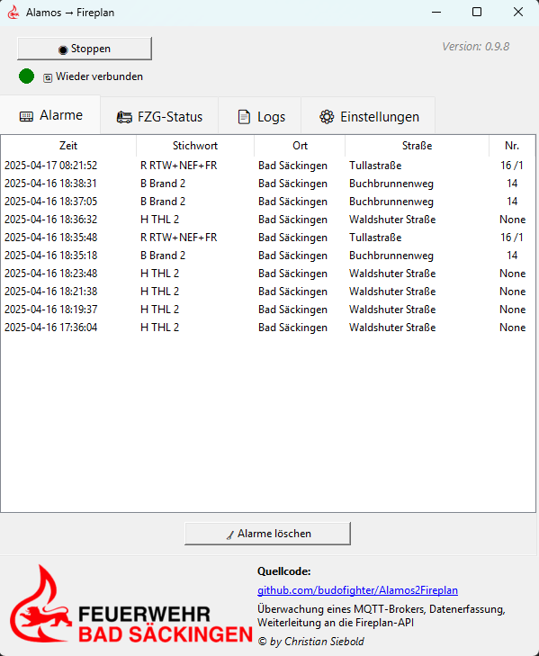
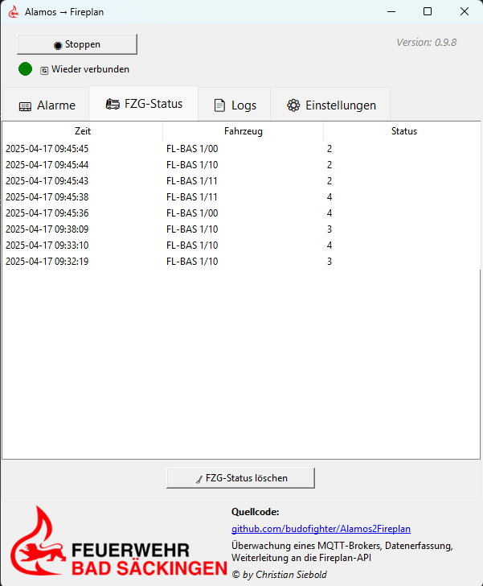

# 🚨 Alamos2Fireplan

**Einsatzdaten-Verarbeitung vom MQTT-Broker**  
➡ Weiterleitung von Alarm- und Fahrzeugdaten an **Fireplan**, **Feuersoftware** und eine **externe Status-API**

---

## 🛠 Voraussetzungen

Einen funktionierenden MQTT-Broker, welcher die Daten von Alamos empfangen kann.
➡ [📘 Anleitung zur Einrichtung von Mosquitto (MQTT-Broker)](MOSQUITTO_SETUP.md)

---

## 💾 Installation

1. **ZIP-Datei herunterladen und entpacken**  
   Die ZIP enthält:

   - `Alamos2Fireplan.exe` → Das Hauptprogramm
   - `_internal/` → Notwendige Programmbibliotheken
   - `logs/`, `.env`, `ric_map.json`, `alarme.db` → werden beim ersten Start automatisch erstellt

2. **Programm starten**  
   Doppelklick auf:
   Alamos2Fireplan.exe

   
---

## ⚙️ Erste Schritte

1. Wechsle in den Tab **„⚙️ Einstellungen“**

2. Trage folgende Felder ein:

- `MQTT_BROKER` – z. B. `127.0.0.1`  
- `MQTT_PORT` – meist `1883`
- `MQTT_TOPIC` – z. B. `alamos/alarm/json` (entsprechend deiner Alamos-Konfiguration)
- `MQTT_USERNAME` / `MQTT_PASSWORD` – falls dein MQTT-Broker geschützt ist

3. Weiter unten:

- `FIREPLAN_SECRET` – dein API-Key
- `FIREPLAN_DIVISION` – Abteilungsname für Fireplan
- *(Optional)* `FEUERSOFTWARE_API_TOKEN`
- *(Optional – für Experten)* Eigene API für Status-Weiterverarbeitung:
  - `EXTERNE_API_URL` – z. B. `https://status.fwbs.de/api.php`
  - `EXTERNE_API_TOKEN` – API-Schlüssel für die Übertragung

4. Klicke auf **💾 Speichern**  
➤ Die `.env` wird automatisch aktualisiert.

---

## 🔁 ISE → RIC Zuordnung

1. Scrolle im Tab **„⚙️ Einstellungen“** ganz nach unten  
➤ Bereich **🔁 ISE - RIC Zuordnung**

2. Klicke auf **📝 Zuordnung bearbeiten**

3. Gib je Zeile eine Zuordnung ein, z. B.:
ise1234sys00abcde12300:1234567

- ➤ Nur gültige RICs (7-stellig, numerisch) werden gespeichert
- ➤ Die ISE-Werte stammen aus dem Alamos-System und entsprechen der eindeutigen Zuordnung in der Leitstelle

4. Klicke auf **💾 Speichern & Schließen**

---

## ⚙️ Konfiguration von Alamos, Fireplan & Feuersoftware

### 🔸 Alamos

> Zwei Einheiten erforderlich: **Alarmeinheit** & **Statuseinheit**

#### 1. Alarmeinheit
 → **JSON-Plugin**
   - Modul: *JSON in Alarmtext schreiben*
   - Version: `v2`
   - Zusätzliche Parameter:
   - `alarmState`
   - `city_abbr`
   - `COBRA_DEVICE_alerted_codes`
   - `COBRA_DEVICE_alerted`
   - `COBRA_DEVICE_alerted_semicolon`
   - `COBRA_keyword_diagnosis`
   - `COBRA_comment`
   
   →→ **MQTT-Plugin**
          - Broker, Username, Passwort gemäß deiner Mosquitto-Konfiguration
          - Topic muss mit `MQTT_TOPIC` in Alamos2Fireplan übereinstimmen

#### 2. Statuseinheit
→ **JSON-Plugin**
  - Modul: *JSON in Alarmtext schreiben*
  - Version: `v2`

  →→ **MQTT-Plugin**
        - Gleich wie oben

---

### 🔸 Fireplan

- RICs müssen exakt mit den RICs aus der **ISE-Zuordnung** übereinstimmen  
➤ *Führende Nullen beachten*  
➤ Es werden nur **A-SubRICs** übergeben

- Fahrzeuge benötigen eine exakte FMS-Kennung, z. B.:  
`FL-BAS 1/10`  
➤ Ggf. alte Fahrzeuge ausblenden und neu anlegen

---

### 🔸 Feuersoftware

- Die FMS-Kennung muss **bereinigt** übergeben werden (da per URL übergeben):  
➤ z. B.: `FLBAS110`

---

## 🧪 Test & Logs

- Logdatei: `logs/app.log`
- Lokale Datenbank: `alarme.db` (SQLite-basiert)
- Tab **„📟 Einsätze“** → Doppelklick für Details & erneutes Senden
- Tab **„📄 Logs“** → Log einsehen oder löschen
- Log-Level über die Einstellungen konfigurierbar
- Über das Tool MQTT-Explorer [MQTT-Explorer](https://mqtt-explorer.com/) kann sehr einfach die MQTT Meldungen überwacht werden, falls es zu einem Problem kommt.

---

## 🖼 GUI-Vorschau

  
  

---

## 👨‍💻 Entwickler

📦 GitHub Repository & Quellcode:  
**[https://github.com/budofighter/Alamos2Fireplan](https://github.com/budofighter/Alamos2Fireplan)**

---

## 📜 Lizenz

MIT License  
© 2025 Christian Siebold

